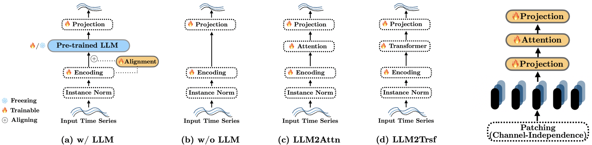

# Are Language Models Actually Useful for Time Series Forecasting?
[Papar Link](https://arxiv.org/pdf/2406.16964) (NeurIPS 2024 Spotlight 🌟)

In this work we showed that despite the recent popularity of LLMs in **time series forecasting (TSF)** they do not appear to meaningfully improve performance. A simple baseline, "PAttn," was proposed, which outperformed most LLM-based TSF models. 

Nevertheless, we do not deny the significant potential of LLMs in time series, **especially in reasoning about time series through text**. You may refer to this [time series reasoning work](https://github.com/behavioral-data/TSandLanguage/tree/main/text_aid_forecast).


Authors: [Mingtian Tan](https://x.com/MTTan1203),[Mike A. Merrill](https://mikemerrill.io/),[Vinayak Gupta](https://gvinayak.github.io/),[Tim Althoff](https://homes.cs.washington.edu/~althoff/),[Thomas Hartvigsen](https://www.tomhartvigsen.com/)


## Overview 💁🏼
Recent work in time series analysis has increasingly focused on adapting pretrained large language models (LLMs) for **forecasting (TSF)**, classification, and anomaly detection. These studies suggest that language models, designed for sequential dependencies in text, could generalize to time series data. While this idea aligns with the popularity of language models in machine learning, direct connections between language modeling and TSF remain unclear. **How beneficial are language models for traditional TSF task?**

Through a series of ablation studies on three recent **LLM-based TSF** methods, we found that **removing the LLM component or replacing it with a simple attention layer did not worsen results—in many cases**, it even led to improvements. Additionally, we introduced PAttn, showing that patching and attention structures can perform as well as state-of-the-art LLM-based forecasters.



The main difference between **PAttn** and [PatchTST](https://github.com/yuqinie98/PatchTST) is that we gradually removed parts of the Transformer module that may not be as essential, and Position Embedding. [DLinear](https://github.com/cure-lab/LTSF-Linear) has been surpassed by many new methods. We aim to provide a method that is both simple and effective, helping new TSF models to evaluate the trade-off between cost and performance.

## Dataset 📖
You can access the well pre-processed datasets from [Google Drive](https://drive.google.com/file/d/1NF7VEefXCmXuWNbnNe858WvQAkJ_7wuP/view), then place the downloaded contents under ./datasets

## Setup 🔧
Three different popular LLM-based TSF methods were included in our ablation approach. You might want to follow the corresponding repos, [OneFitsAll](https://github.com/DAMO-DI-ML/NeurIPS2023-One-Fits-All), [Time-LLM](https://github.com/KimMeen/Time-LLM), and [CALF](https://github.com/Hank0626/CALF), to set up the environment respectivly. For the **''PAttn''** method, the environment from any of the above repos is compatible.


## PAttn: 
     cd ./PAttn 

     bash ./scripts/ETTh.sh (for ETTh1 & ETTh2)
     bash ./scripts/ETTm.sh (for ETTm1 & ETTm2)
     bash ./scripts/weather.sh (for Weather)
     
#### For other datasets, Please change the script name in above command.

## Ablations
     
#### Run Ablations on CALF (ETT) :
     
    cd ./CALF
    sh scripts/long_term_forecasting/ETTh_GPT2.sh
    sh scripts/long_term_forecasting/ETTm_GPT2.sh
    
    sh scripts/long_term_forecasting/traffic.sh 
    (For other datasets, such as traffic)

#### Run Ablations on OneFitsAll (ETT) :
     cd ./OFA
     bash ./script/ETTh_GPT2.sh   
     bash ./script/ETTm_GPT2.sh

     bash ./script/illness.sh 
     (For other datasets, such as illness)

#### Run Ablations on  Time-LLM (ETT) 
     cd ./Time-LLM-exp
     bash ./scripts/train_script/TimeLLM_ETTh1.sh
     bash ./scripts/train_script/TimeLLM_ETTm1.sh 

     bash ./scripts/train_script/TimeLLM_Weather.sh
     (For other datasets, such as Weather)

#### (To run ablations on other datasets, please change the dataset name as shown in example.)

## Acknowledgement

This codebase is built based on the [Time-Series-Library](https://github.com/thuml/Time-Series-Library). Thanks!


## Citation
If you find our work useful, please kindly cite our work as follows:
```bibtex
@article{tan2024language,
  title={Are Language Models Actually Useful for Time Series Forecasting?},
  author={Tan, Mingtian and Merrill, Mike A and Gupta, Vinayak and Althoff, Tim and Hartvigsen, Thomas},
  journal={arXiv preprint arXiv:2406.16964},
  year={2024}
}

